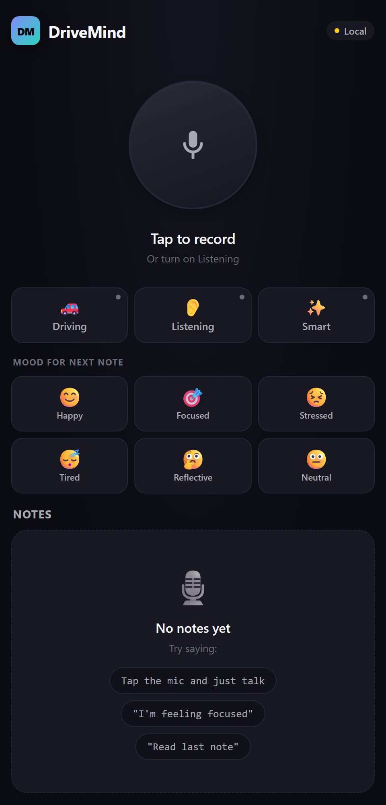
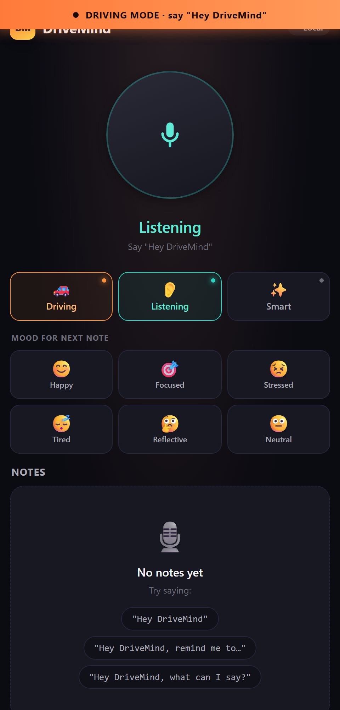
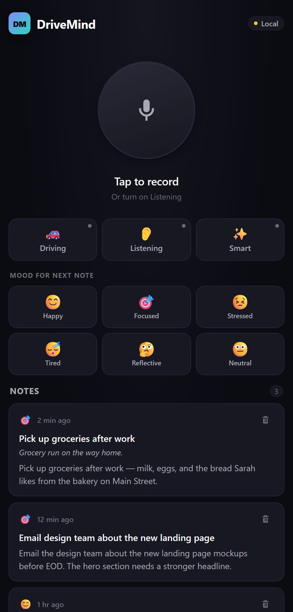

# DriveMind (web)

Hands-free voice note-taking for drivers — say **"Hey DriveMind"** and just talk. Notes are transcribed by OpenAI Whisper, structured into title / summary / tags / mood, and stored in Firebase (or browser localStorage when Firebase isn't configured). Built with React + Vite, runs in any modern browser.

**Live demo:** _coming soon — auto-deployed via GitHub Pages_

> ⚠️ The live demo runs the full UI but transcription requires an `OPENAI_API_KEY`. Clone and run locally to enable voice features end-to-end.

<p align="center">
  
  &nbsp;
  
  &nbsp;
  
</p>

## Why

Existing voice-note apps still demand taps for record, stop, save, edit. While you're driving you can't tap. DriveMind is purpose-built for a single hands-free loop:

> **"Hey DriveMind, remind me to email Sarah about the design review on Thursday."**
>
> *"Got it. Remind me to email Sarah about the design review on Thursday."*

That's it. No buttons, no looking at the phone.

## Features

- **🎙️ Real-time voice → structured note pipeline** using OpenAI Whisper (~2-3s latency end-to-end)
- **🚗 Driving mode** — bundles wake-phrase + listening + screen wake lock + full read-back so the loop never requires a tap
- **🗣️ Conversational wake** — say "Hey DriveMind" alone, the app replies "Yes?" and waits for your note
- **🎚️ Voice activity detection** — listens continuously, auto-records when you speak, auto-stops on ~1.2s of silence (Web Audio API `AnalyserNode`)
- **⚡ Voice commands** — `scratch that`, `read last note`, `read all my notes`, `stop listening`, `I'm feeling focused`, `help`
- **🧠 Smart structuring** — optional `gpt-4o-mini` pass extracts title, summary, tags, and mood as JSON
- **🎯 Mood tagging** — manual chips + automatic detection from text
- **🔊 Audio feedback** — Web Speech API for spoken confirmations, Vibration API on supported devices
- **☁️ Cloud sync** — Firebase Firestore when configured, browser localStorage fallback
- **🔇 Echo-aware** — listening pauses while the app speaks so its own TTS doesn't loop into a new note
- **💾 Persisted preferences** — listening mode, wake-phrase, driving mode, GPT structuring all remembered across reloads

## Hands-free flow

| You say | What happens |
|---|---|
| *"Hey DriveMind"* | App replies *"Yes?"*, waits up to 12s for your note |
| *"Hey DriveMind, [your note]"* | Saves in one breath, reads back full text |
| *"Scratch that"* / *"Delete last note"* | Removes the most recent note |
| *"Read last note"* / *"Read back"* | TTS reads it (listening pauses to prevent echo loop) |
| *"Read all my notes"* | Reads up to 3 most recent notes |
| *"Stop listening"* / *"I'm done"* | Turns listening off |
| *"I'm feeling focused"* | Sets mood for next note |
| *"What can I say?"* / *"Help"* | Speaks the command menu |

## Architecture

Layered, SOLID-friendly structure. Each layer depends on the one below it.

```
src/
  config/firebase.js              Firebase init + isFirebaseConfigured flag
  services/
    storage.js                    Firebase Firestore | localStorage interface
    transcription.js              OpenAI Whisper (fetch + FormData)
    noteStructuring.js            cleaning + tags + mood + GPT structuring
    audioFeedback.js              Speech Synthesis + Vibration API
    voiceCommands.js              regex-based intent parser
  hooks/
    useRecording.js               MediaRecorder + AudioContext metering
    useNotes.js                   CRUD over the storage interface
    useVoiceActivation.js         continuous VAD + wake-phrase + pause/resume
    useWakeLock.js                Screen Wake Lock API for driving mode
  utils/
    time.js                       relative timestamps ("2 min ago")
  components/
    HeroMic.jsx                   state-driven mic button (idle / listening /
                                  conversation / capturing / recording / paused)
    ModeToggle.jsx                pill toggles for Driving / Listening / Smart
    MoodSelector.jsx              mood tile grid
    NoteCard.jsx                  expandable note card with swipe-style delete
    NotesFeed.jsx                 list of NoteCards
    EmptyState.jsx                friendly empty state with sample commands
    CommandToast.jsx              floating toast for last recognized command
  App.jsx                         composition / screen layout
```

## Quick start

```powershell
git clone https://github.com/cwolf277/drivemind-web.git
cd drivemind-web
npm install
copy .env.example .env
# edit .env and set VITE_OPENAI_API_KEY
npm run dev
```

Open http://127.0.0.1:5173 in Chrome (or any modern browser) and grant microphone access.

## Configuration

`.env` (copy from `.env.example`):

```
# Required for transcription
VITE_OPENAI_API_KEY=sk-...

# Optional: enables cloud sync (otherwise notes live in localStorage)
VITE_FIREBASE_API_KEY=
VITE_FIREBASE_AUTH_DOMAIN=
VITE_FIREBASE_PROJECT_ID=
VITE_FIREBASE_STORAGE_BUCKET=
VITE_FIREBASE_MESSAGING_SENDER_ID=
VITE_FIREBASE_APP_ID=
```

Without Firebase keys, notes persist in browser localStorage. To enable cross-device sync:

1. Create a Firebase project, enable Firestore
2. Add a Web app, copy the config keys into `.env`
3. For dev, allow open access to `notes` collection (lock down before shipping):
   ```
   match /notes/{doc} { allow read, write: if true; }
   ```

## Tech stack

- **Frontend**: React 18, Vite 5
- **Audio**: Web Audio API (`AudioContext`, `AnalyserNode`), MediaRecorder API
- **Transcription**: OpenAI Whisper (`whisper-1`)
- **Structuring**: OpenAI GPT-4o-mini (optional, off by default)
- **Storage**: Firebase Firestore SDK v10 / Web localStorage fallback
- **TTS**: Web Speech API (`SpeechSynthesisUtterance`)
- **Haptics**: Vibration API (mobile)
- **Wake lock**: Screen Wake Lock API (driving mode)

## Security notes

- `VITE_OPENAI_API_KEY` and Firebase config are bundled into the client. That's fine for local development and personal use; **for production**, front Whisper / GPT calls with a small server (Cloud Functions, Cloudflare Worker, etc.) so the key isn't exposed in the bundle.
- The current Firestore rules in setup are dev-only. Lock down with Firebase Auth + per-user rules before shipping.

## Browser support

Tested on **Chrome / Edge on Windows**. Should work in any browser that supports `MediaRecorder` + Web Audio + Web Speech API. Safari has spotty `MediaRecorder` support; Screen Wake Lock is Chrome-only.

## Repos

- **[cwolf277/drivemind-web](https://github.com/cwolf277/drivemind-web)** — this repo (web)
- **[cwolf277/DriveMind](https://github.com/cwolf277/DriveMind)** — original React Native version (Expo)
